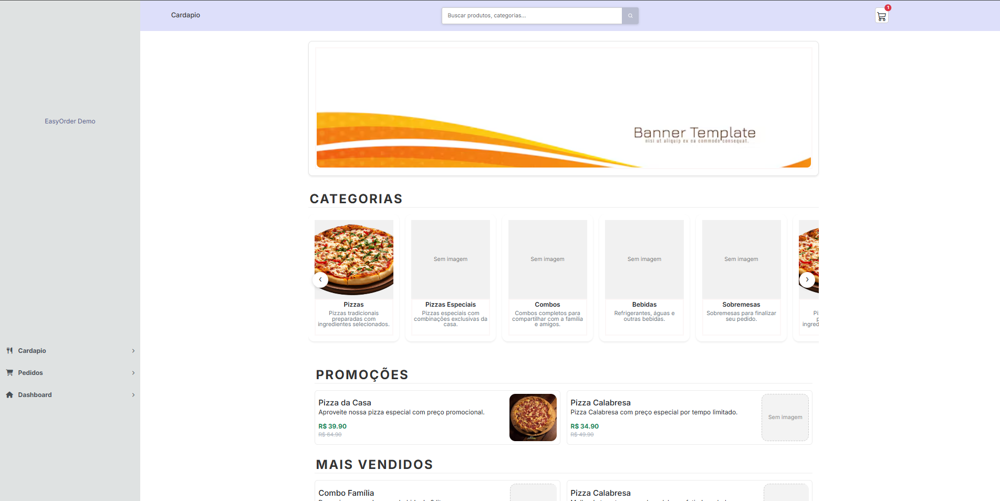
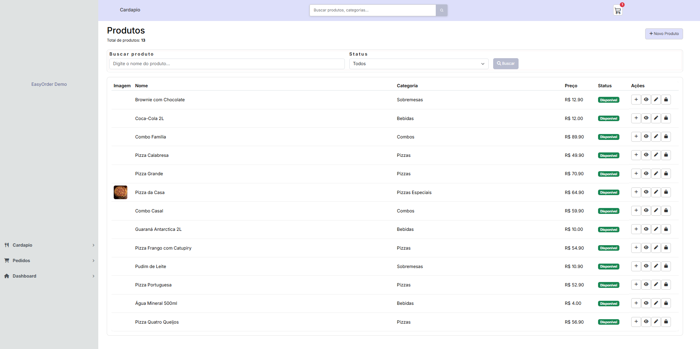
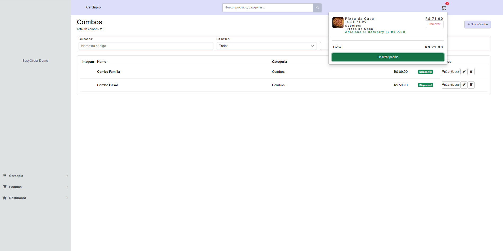
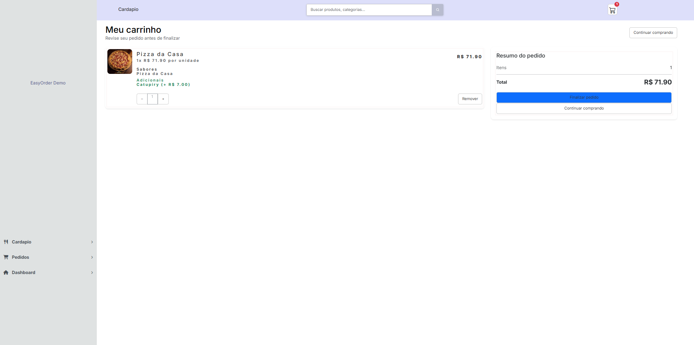
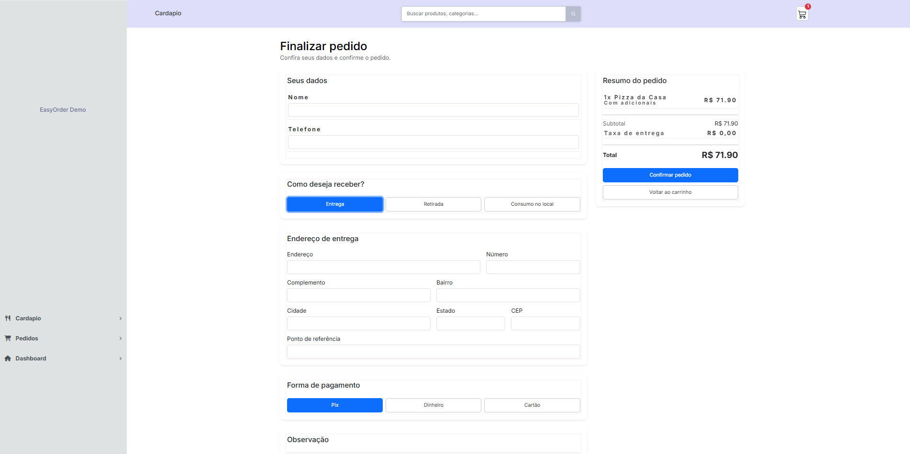
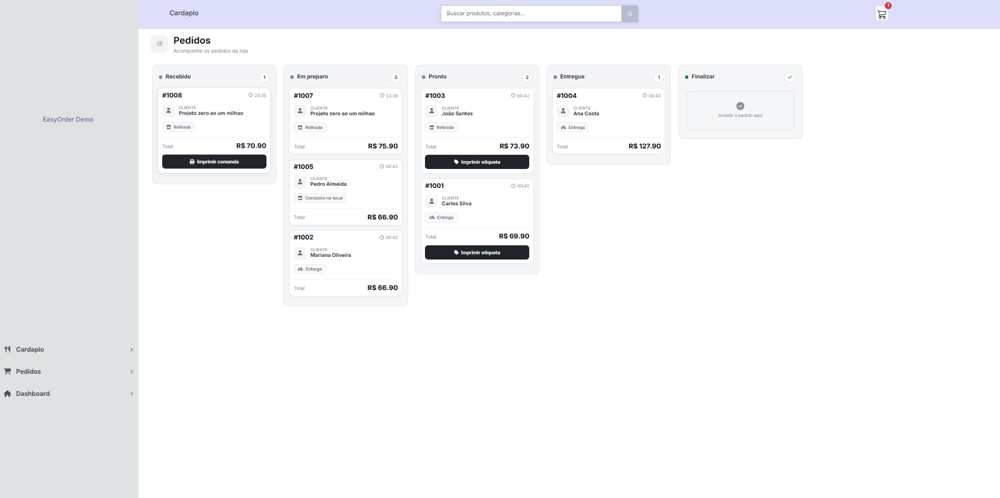

# 🍽️ EasyOrder

**Sistema web de gestão de cardápio, pedidos e pagamentos para estabelecimentos alimentícios, desenvolvido com Python + Django.**

---

## 📸 Demonstração

### Cardápio



### Personalização de produtos




### Carrinho e pedidos






### Kanban




### 🛠️ Instalação

```bash
git clone <https://github.com/JonasHoffman/EasyOrder.git>
cd EasyOrder

python -m venv venv

# Windows
venv\Scripts\activate

# Linux/macOS
source venv/bin/activate

pip install -r requirements.txt
cp .env.example .env

python manage.py migrate
python manage.py seed_demo
python manage.py runserver
```

Acesse **http://127.0.0.1:8000/**.

O comando `seed_demo` cria automaticamente uma loja de demonstração com produtos, sabores, combos, promoções e pedidos, permitindo avaliar o sistema sem necessidade de cadastro manual. Atualmente, os dados de demonstração são criados sem imagens.

---

## ✨ Funcionalidades principais

* **Cardápio dinâmico** — categorias, produtos simples e combos, promoções e seções configuráveis 
como banner, mais vendidos e recomendados.

* **Personalização de produtos** — múltiplos sabores com limite configurável por produto, 
ingredientes removíveis e adicionais.

* **Combos compostos por grupos** — por exemplo, um Combo Família pode possuir grupos de Pizza, 
Bebida e Sobremesa, cada um com seus próprios produtos e quantidades.

* **Carrinho com identidade de item** — produtos iguais com personalizações diferentes são tratados 
como itens distintos no carrinho.

* **Pedidos com histórico de status** — alterações de status são registradas, mantendo um snapshot 
dos dados do pedido no momento da compra, como preço, sabores e adicionais.

* **Kanban operacional** — acompanhamento visual dos pedidos por etapa de produção: recebido → 
em preparo → pronto → entregue.

* **Pagamentos via Efí** — suporte a PIX, cartão e dinheiro na entrega, com confirmação processada 
por webhook no backend, sem depender do frontend.

---

## 🏗️ Estrutura principal

```text
EasyOrder/
├── Cardapio/       # produtos, sabores, combos, adicionais e carrinho
├── Lojas/          # dados do estabelecimento
├── Pedidos/        # pedidos, status, histórico e Kanban
├── Pagamento/      # integração com Efí e webhooks
├── Vendas/         # processos relacionados às vendas
├── manage.py
├── requirements.txt
└── .env.example
```

---

## ⚙️ Stack

### Backend

* Python 3.12
* Django
* Django ORM
* Django Forms
* Django Sessions
* Django Authentication

### Frontend

* HTML5
* CSS3
* JavaScript
* Fetch API
* DOM dinâmico

### Banco de dados

* SQLite
* Django ORM

### Pagamentos

* Efí
* PIX
* Cartão
* Webhooks

### Ferramentas

* Git
* GitHub
* VS Code

---

## 🧪 Dados para demonstração

O projeto possui um **Management Command** responsável por preparar automaticamente um ambiente de demonstração:

```bash
python manage.py seed_demo
```

São criados dados como:

* Loja de demonstração
* Usuário avaliador
* Categorias
* Produtos
* Sabores
* Grupos de sabores
* Ingredientes
* Adicionais
* Combos
* Promoções
* Estruturas do cardápio
* Status de pedidos

Dessa forma, o avaliador consegue executar o sistema rapidamente sem precisar realizar todo o 
cadastro inicial manualmente.

---

## 📊 Principais regras de negócio

### Produtos

* Produtos podem ser simples ou combos.
* Produtos podem possuir ingredientes.
* Produtos podem possuir adicionais.
* Produtos podem permitir múltiplos sabores.

### Sabores

* Produtos podem estar vinculados a grupos de sabores.
* Cada produto pode definir uma quantidade máxima de sabores.
* O cliente não pode ultrapassar a quantidade permitida.

### Combos

* Combos possuem grupos de escolha.
* Cada grupo possui seus próprios produtos disponíveis.
* Os produtos podem possuir quantidades definidas dentro do combo.

### Carrinho

* Itens personalizados são identificados individualmente.
* Quantidades podem ser atualizadas.
* Produtos podem ser removidos.
* Os valores são recalculados conforme os itens.

### Pedidos

* Pedidos possuem diferentes status.
* Alterações podem ser registradas no histórico.
* O pedido percorre diferentes etapas operacionais.

### Pagamentos

* O pagamento possui seu próprio estado.
* A confirmação do pagamento pode atualizar o pedido.
* Eventos externos podem ser processados através de webhooks.

---

## 🔮 Roadmap

* [ ] Dashboard de vendas
* [ ] Relatórios gerenciais
* [ ] Controle de estoque integrado aos pedidos
* [ ] Gestão financeira
* [ ] Impressão de pedidos
* [ ] Notificações em tempo real
* [ ] Atualização do Kanban em tempo real
* [ ] Sistema de cupons
* [ ] Programa de fidelidade
* [ ] Avaliação de pedidos
* [ ] Testes automatizados abrangentes
* [ ] Deploy em produção
* [ ] Monitoramento e observabilidade

---

## 👨‍💻 Desenvolvedor

### Jonas de Souza Hoffman

Desenvolvedor com foco em **Python e Django**, interessado na construção de sistemas web completos 
e na resolução de problemas através de software.

O desenvolvimento do EasyOrder envolve conhecimentos em:

* Backend
* Desenvolvimento web
* Django
* Banco de dados
* JavaScript
* Arquitetura de aplicações
* Integração entre sistemas
* Regras de negócio

---

## 📫 Contato

* **GitHub:** JonasHoffman
* **LinkedIn:** www.linkedin.com/in/jonas-souza-hoffman-983887250
* **Email:** jonas-souza21@hotmail.com

---

## ⭐ EasyOrder

**Um sistema completo para conectar cardápio, pedidos, pagamentos e operação em uma única aplicação.**

Desenvolvido com **Python + Django + JavaScript**.

⭐ Se este projeto foi útil, considere deixar uma estrela no repositório.